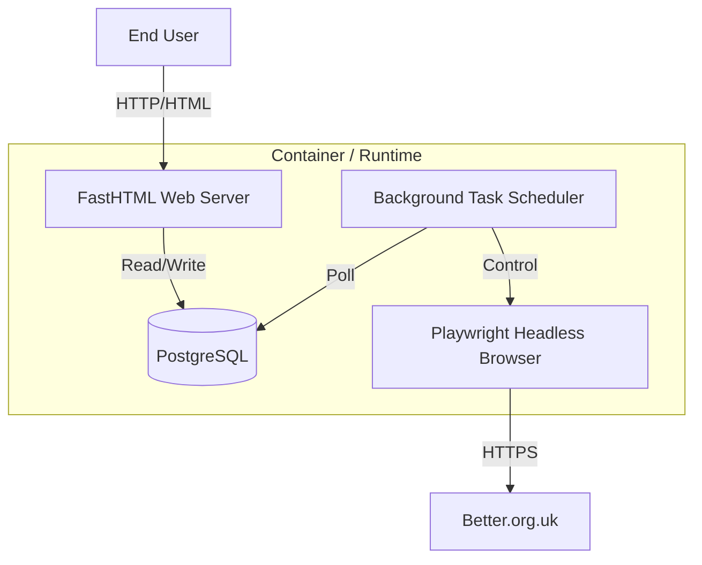

# Technical Design Document: Better Booking Automation

## 1. System Architecture

The application follows a monolithic architecture designed for containerized deployment. It consists of three primary components running within a single runtime environment.

### 1.1 Components
1.  **Web Server (FastHTML):** Handles user interactions, CRUD operations for Tasks/Profiles, and renders the UI.
2.  **Database (PostgreSQL):** Persists application state. Accessed via `FastSQL` (SQLAlchemy wrapper).
3.  **Automation Worker:** A background process (or async task) that periodically polls the database for `PENDING` or `RUNNING` tasks and executes the automation logic.
4.  **Automation Engine:** A Python class wrapping `Playwright` to handle browser interactions, DOM manipulation, and navigation flow.

## 2. Database Schema

We use `FastSQL` to define models.

### 2.1 UserAccount
*   `id`: Integer, Primary Key
*   `name`: String, Display name (e.g., "John's Account")
*   `email`: String, Unique (Used for login)
*   `password_encrypted`: String (Fernet encrypted)

### 2.2 PaymentProfile
*   `id`: Integer, Primary Key
*   `user_account_id`: Integer, ForeignKey(`user_account.id`)
*   `alias`: String (e.g., "Amex Gold")
*   `cardholder_name`: String
*   `card_number_encrypted`: String (Fernet encrypted)
*   `expiry_month`: String (MM)
*   `expiry_year`: String (YY)
*   `cvv_encrypted`: String (Fernet encrypted)
*   `address_line_1`: String
*   `city`: String
*   `postcode`: String

### 2.3 Task
*   `id`: Integer, Primary Key
*   `user_account_id`: Integer, ForeignKey(`user_account.id`)
*   `payment_profile_id`: Integer, ForeignKey(`payment_profile.id`)
*   `leisure_centre`: Enum (Hendon, Copthall, Burnt Oak)
*   `target_date`: Date
*   `duration`: Integer (40 or 60)
*   `status`: Enum (`PENDING`, `CHECKING`, `BOOKING`, `SUCCESS`, `FAILED`, `STOPPED`)
*   `last_checked_at`: DateTime
*   `created_at`: DateTime

### 2.4 Booking
*   `id`: Integer, Primary Key
*   `task_id`: Integer, ForeignKey(`task.id`)
*   `reference_number`: String (Extracted from confirmation page)
*   `booked_at`: DateTime
*   `court_name`: String (e.g., "Court 1")
*   `price`: String

### 2.5 SystemLog
*   `id`: Integer, Primary Key
*   `timestamp`: DateTime
*   `level`: Enum (INFO, WARN, ERROR)
*   `source`: String (e.g., "Worker", "Web")
*   `message`: Text
*   `task_id`: Integer, Nullable (Link log to specific task)

## 3. Automation Design (The Bot)

The automation logic is encapsulated in a `BookingBot` class.

### 3.1 Workflow Logic
1.  **Initialization:**
    *   Launch Playwright (Chromium).
    *   Create a BrowserContext.
2.  **Availability Check:**
    *   Construct URL based on Task criteria.
    *   `page.goto(url)`
    *   Wait for slot elements (`.slot` or similar selectors).
    *   Filter slots by specific time (if implemented) or grab the first available "Book" button.
3.  **Booking Sequence (If slot found):**
    *   Click "Add to Basket".
    *   **Login Flow:**
        *   Detect login redirect or popup.
        *   Fill `email` and `password`.
        *   Submit.
    *   **Checkout Flow:**
        *   Navigate to Basket/Checkout.
        *   Accept Terms & Conditions.
        *   **Payment:**
            *   Select "Pay by Card".
            *   Fill iframe payment form (Requires specific frame handling in Playwright).
            *   Submit Payment.
    *   **Confirmation:**
        *   Wait for success page.
        *   Extract Reference Number.
        *   Screenshot confirmation.
4.  **Error Handling:**
    *   **Timeouts:** Retry 3 times before failing the cycle.
    *   **Login Failure:** Mark Task as `FAILED` (Authentication Error).
    *   **Slot Taken:** If slot disappears during checkout, log and retry next cycle.

### 3.2 Concurrency
*   To avoid detection and resource exhaustion, the worker will process one Task at a time (Sequential) in version 1.0.
*   A `Scheduler` loop will query the DB every X seconds (e.g., 30s) for active tasks.

## 4. Security Considerations

### 4.1 Credential Storage
*   **Problem:** Storing passwords and CVVs in plain text is a security risk.
*   **Solution:** Use `cryptography` library (Fernet symmetric encryption).
    *   Generate a `SECRET_KEY` on first run (stored in `.env` or environment variables).
    *   Encrypt data before `INSERT`.
    *   Decrypt data only within the `BookingBot` memory immediately before typing into the browser.

### 4.2 Browser Isolation
*   Incognito mode (Contexts) ensures no cookies/session data leak between different User Accounts.

## 5. Deployment Strategy

### 5.1 Dockerfile
*   **Base Image:** `mcr.microsoft.com/playwright/python:v1.40.0-jammy` (Includes Python + Browsers).
*   **Dependencies:** `requirements.txt` (FastHTML, FastSQL, psycopg2-binary, cryptography).
*   **Entrypoint:** A shell script `start.sh` that:
    1.  Runs DB migrations (if any).
    2.  Starts the Background Worker (`python worker.py &`).
    3.  Starts the Web Server (`python main.py`).

### 5.2 Railway Configuration
*   **Service 1 (Postgres):** Standard managed instance.
*   **Service 2 (App):** Builds from the Dockerfile.
    *   Env Vars: `DATABASE_URL`, `ENCRYPTION_KEY`.
    *   Volume: Optional, for persisting screenshots/logs if needed (ephemeral is usually fine for this).

## 6. UI/UX Design (FastHTML)

*   **Dashboard (`/`):**
    *   **Stats Cards:** Active Tasks, Bookings Today.
    *   **Task List:** Table showing Status, Last Check, Action Buttons (Stop/Delete).
*   **Create Task (`/tasks/new`):** Form with Location (Select), Date (Date Picker), Duration (Radio), User (Select).
*   **Settings (`/settings`):**
    *   Manage Users (Add/Remove).
    *   Manage Payment Profiles.
*   **Logs (`/logs`):** A scrollable text view or table of `SystemLog` entries.
